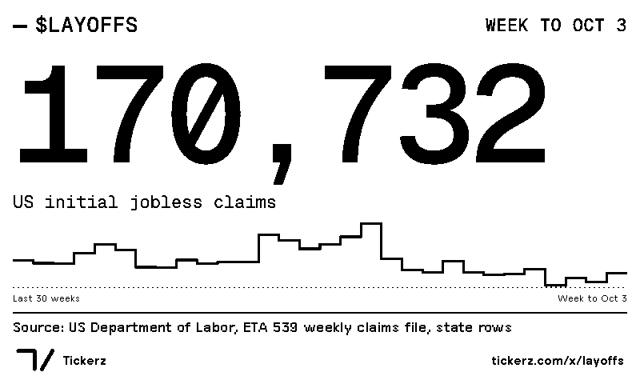
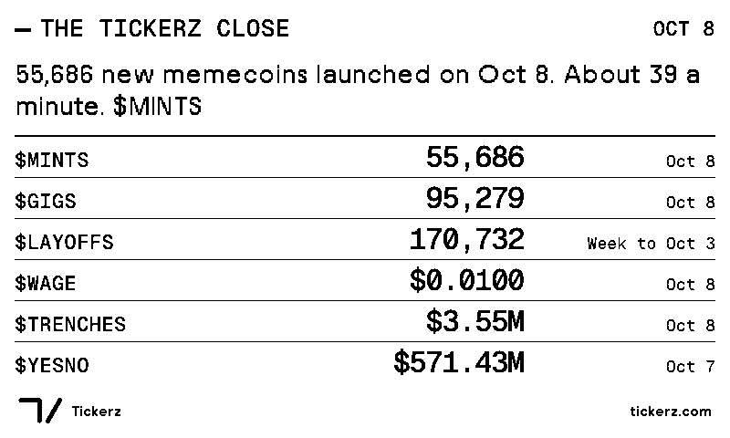
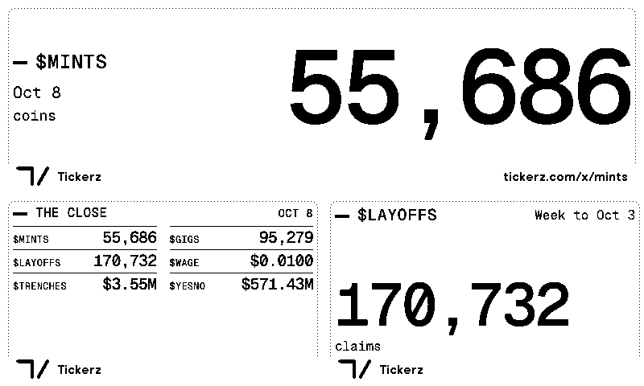
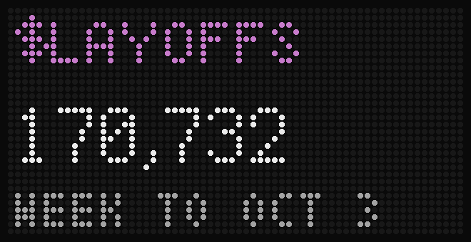
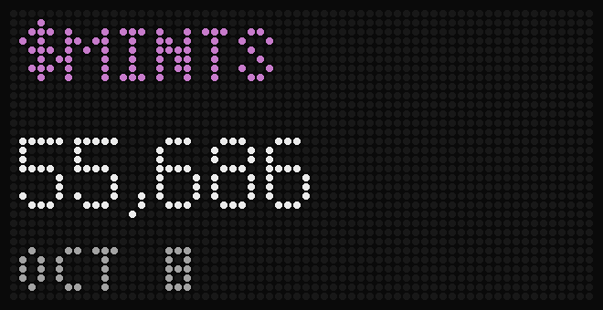

# Tickerz on desk displays

A Tickerz number on the desk displays people already own: a plugin for TRMNL e-paper screens and an app for Tidbyt LED panels run by a Tronbyt server. Both are free and read Tickerz's public API (https://tickerz.com/api/v1, no key, no account with Tickerz).

Each one shows either:

- **The Tickerz Close**, the day's six daily numbers ($MINTS, $GIGS, $LAYOFFS, $WAGE, $TRENCHES, $YESNO), or
- **one index** you pick: $LAYOFFS, $MINTS, $GIGS, $WAGE, $TRENCHES, $YESNO, $JOBS, $UNEMP, $CPI or $CORECPI.

The number is always the newest complete reading (`latest_complete` in the API), never a day still being counted. Numbers are written as on tickerz.com: 170,732; $584.41M; $0.0100; 4.2%. Periods too: "Oct 8", "Week to Oct 3", "Sep 2026".

The Close is the record of what Tickerz printed that day and does not change. One index shows its current reading, which can differ for the same day when its source revises it: on Oct 9 the Close had $YESNO for Oct 7 at $571.43M and the $YESNO index had $584.41M.

| TRMNL, one index | TRMNL, the Close |
|---|---|
|  |  |

| TRMNL, in a mashup | Tidbyt or Tronbyt |
|---|---|
|  |   |

The TRMNL images are 1-bit, as the 7.5 inch TRMNL draws them, rendered by TRMNL's own preview tool from the live API on Oct 9 2026. The LED images are Pixlet's render of the app, drawn as dots.

## What is here

```
trmnl/
  src/settings.yml          The plugin: polling URL, refresh, the Index picker
  src/shared.liquid         Formatting shared by every layout (numbers, periods, the chart)
  src/full.liquid           800 by 480: ticker, number, period, a stepped line of the last 30 readings, the source
  src/half_horizontal.liquid, half_vertical.liquid, quadrant.liquid   The same number in TRMNL's mashup slots
  .trmnlp.yml               Local preview settings (not uploaded)
pixlet/
  tickerz.star              The Pixlet app for 64 by 32 panels
  manifest.yaml             App details for a Tronbyt or Tidbyt app list
screenshots/
```

## TRMNL

TRMNL runs your own plugins as "private plugins". They need TRMNL's Developer edition add-on (a one-time upgrade in the device settings) or a BYOD license.

**Import (fastest).** Zip the five Liquid files and settings.yml, with no folder inside the ZIP:

```bash
cd displays/trmnl/src && zip ../tickerz-trmnl.zip settings.yml *.liquid
```

Then on https://trmnl.com/plugin_settings?keyname=private_plugin choose **Import new** and pick `tickerz-trmnl.zip`. TRMNL creates the plugin and adds it to your playlist. Open its settings to pick an index (the Close is the default).

**By hand.** In TRMNL, Plugins, Private Plugin:

1. Name: Tickerz. Strategy: **Polling**. Polling verb: GET.
2. Polling URL, for the Close:
   ```
   https://tickerz.com/api/v1/indices/close
   ```
   or for one index, its name in lower case:
   ```
   https://tickerz.com/api/v1/indices/layoffs
   ```
3. Refresh: hourly is plenty. The Close prints once a day and each index at most once a day.
4. Save, then **Edit Markup**. Paste `src/shared.liquid` into the Shared tab and each layout file into its tab (Full, Half Horizontal, Half Vertical, Quadrant). Click **Force Refresh**.

**With trmnlp.** TRMNL's preview tool (https://github.com/usetrmnl/trmnlp, Ruby 4) can preview and upload the folder:

```bash
gem install trmnl_preview
cd displays/trmnl
TICKERZ_INDEX=layoffs trmnlp serve
```

Open http://localhost:4567. `trmnlp build --png` writes the images (it needs Firefox and ImageMagick); `trmnlp login` and `trmnlp push` upload the plugin to your TRMNL account.

Notes:
- Fonts: numbers and tickers are Geist Mono (loaded from Google Fonts); words stay in TRMNL's own fonts, which are drawn for e-paper. If Geist Mono cannot load, numbers fall back to a monospace font.
- Mark: the title bar uses the solid Tickerz mark. The tape finish is kept for 96px and up, so it is not used at title bar size.
- One index's answer is about 15 KB (it carries 100 past readings for the chart). TRMNL does not publish a size limit for polling. If an index ever fails to load on a device, the Close (1.4 KB) still works.

## Tidbyt and Tronbyt

`pixlet/tickerz.star` draws the ticker in plum, the number, and its period. A line wider than the panel scrolls. With the Close it shows each of the six numbers in turn, 2.5 seconds each.

**On a Tronbyt server** (https://github.com/tronbyt/server): open your device, **Add app**, **Upload app**, choose `tickerz.star`. Then add it, pick an index (the Close is the default) and save.

**Locally** with Pixlet (Tronbyt's build: https://github.com/tronbyt/pixlet):

```bash
pixlet serve displays/pixlet/tickerz.star
```

opens a preview at http://localhost:8080, and

```bash
pixlet render displays/pixlet/tickerz.star index=mints --format gif -m 8
```

writes a GIF. The app caches each answer for 15 minutes.

## Tested

- TRMNL: trmnlp 0.26.0 (framework 3.4.0) against the live API on Oct 9 2026: every layout for the Close and for $LAYOFFS, $MINTS, $YESNO, $WAGE, $JOBS and $UNEMP; `trmnlp lint` passes.
- Pixlet: v0.54.0 (Tronbyt), `pixlet check` passes; rendered for the Close and seven indexes.
- Not yet run on a physical TRMNL or Tidbyt.

The data and its sources: https://tickerz.com/methodology. The API: https://tickerz.com/docs. License: MIT, as the rest of this repository.
